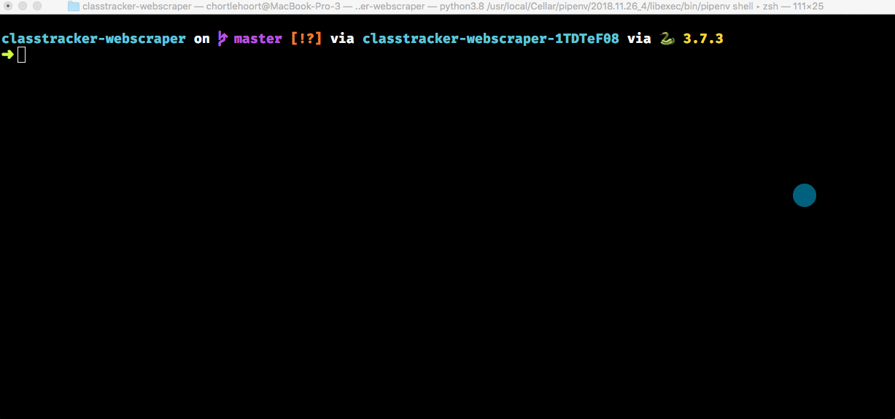
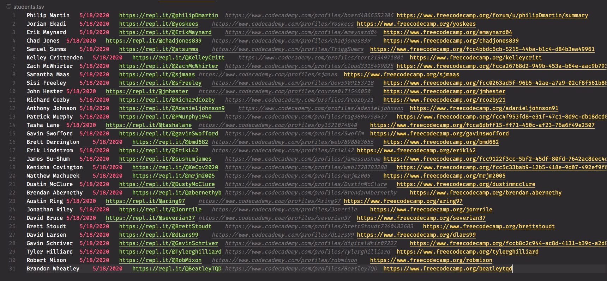
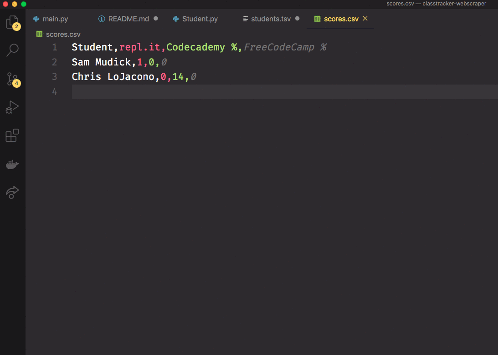

# Foundation Course Progress Scraper

## Description

Scrapes the various Foundations Course site profiles for each student and calculates how much each student has completed.



## Requirements

- Python 3.6+
- Chrome
- pipenv (`brew install pipenv`)

## Drivers

1. Install the geckodriver with the following command. It can also be installed via `pip` if you're an unfortunate Windows user.
    ```sh
    brew install geckodriver
    ```
1. Install the Chrome Driver by visiting the [downloads web page](https://sites.google.com/a/chromium.org/chromedriver/home) and downloading the latest stable release. Once you have it downloaded, decompress the archive and move the resulting file to a directory that is on your path.

## How to run

1. `pipenv install` to create the virtual environment and get packages installed.
1. `pipenv shell` to activate environment
1. Open the `students.tsv` file.
1. Copy pasta the students you need from the **_Foundations Course Student Registration (Responses)_** [spreadsheet](https://docs.google.com/spreadsheets/d/1jlxGp0OINxtPsVrabffEP54ysRnHlhCi4CB2ZX1iwH8/edit?usp=sharing). Copy columns B-F.
    
1. `python main.py` to start the process.
1. When the program completes, there will be a `scores.csv` file created. Open that file.
1. Copy pasta the contents into your cohort spreadsheet.
1. As soon as you paste, a clipboard icon will appear in the lower-right hand corner of the data. Click that and choose _"Split text into columns"_.



## Foundations Course Communication Email

If a student's progress is below the 50% mark across the board, the system will generate a draft email to be sent out from your NSS email account.

Here is the default template.

---

Hi Ryan,

In a regular progress check for your cohort, I noticed that you haven't completed a significant percentage of the coursework yet. Here's what I can see from your profiles.

* FreeCodeCamp: 35% completed
* Codecademy: 10% completed
* repl.it: 23% completed

I'm concerned because the completion of the Foundations Course is crucial to you being prepared and being successful when your cohort starts. We assume that you have completed the work, and we hit the ground running. We don't spend time covering the fundamentals that the Foundations Course provides.

Please let me know if there's anything I can do to help you complete the work. I also recommend that you attend the Prework Sessions that happen every week before class starts. It allows you to speak with your teammates, and with graduates of the program to get assistance on specific things that you may be struggling with.

Best regards,
Your name - Senior Instructor

---